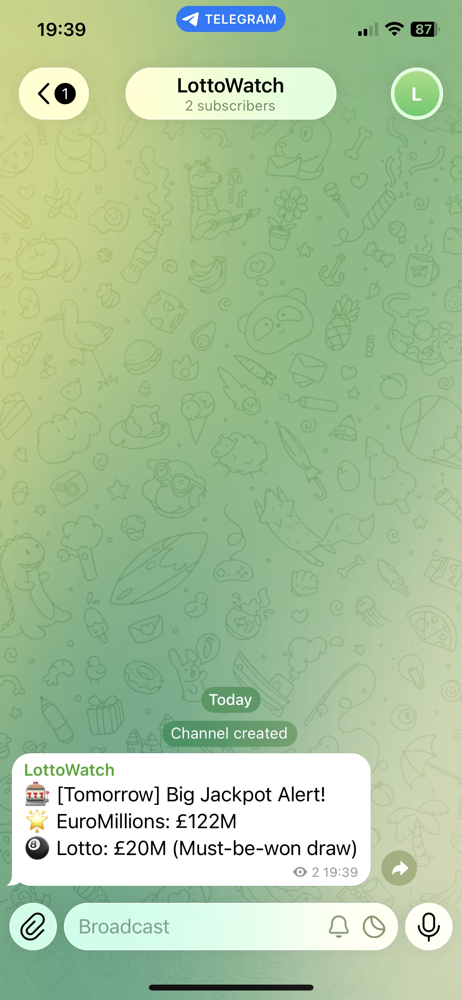

# LottoWatch - National Lottery High Prizes Notifier

LottoWatch is a simple tool that notifies you when National Lottery prizes become above average. You’ll get reminders after work the day before a big draw, so you never miss out on a great opportunity. By focusing only on decent prizes, you will save money on playing about 40% of the time instead of every time.

Join the Telegram channel to receive high jackpot notifications: https://t.me/lottowatch



## Schedule

Runs Monday to Friday at 5pm (Europe/London) — cron: `0 17 * * 1-5`, triggered via [cron-job.org](https://cron-job.org) for reliable scheduling (GitHub Actions cron is best-effort and can be delayed by hours).

## Games

| Game | Draw Days | Average[^stats] | Median[^stats] | Max[^stats] | Historic Highest | Notifying Condition |
|------|-----------|---------|--------|------------|------------------|---------------------|
| EuroMillions | Tuesday, Friday | £69M | £62M | £181M | £195M | <ul><li>Jackpot ≥ £75,000,000[^em]</li></ul> |
| Lotto | Wednesday, Saturday | £7M | £7M | £15M | £66M | <ul><li>Jackpot ≥ £7,500,000[^lotto]</li><li>Must-be-won draw</li></ul> |

[^stats]: Based on last 52 draws (180 days) as of 31 May 2026.
[^em]: Threshold calibrated to ~40% of draws — 21 of 52.
[^lotto]: Threshold calibrated to ~38% of draws — 20 of 52.

## Notifiers

| Name | When | Output |
|------|------|--------|
| Console | `--test` mode | Prints a table to stdout |
| Telegram | Scheduled runs | Sends a message to the channel |

## How to Run Locally

Install dependencies:

```bash
pip install -e .
```

Run in test mode — skips the day check and prints to console:

```bash
python main.py --test
```
